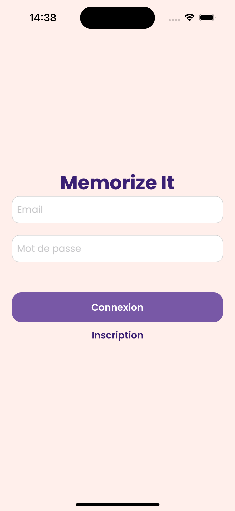
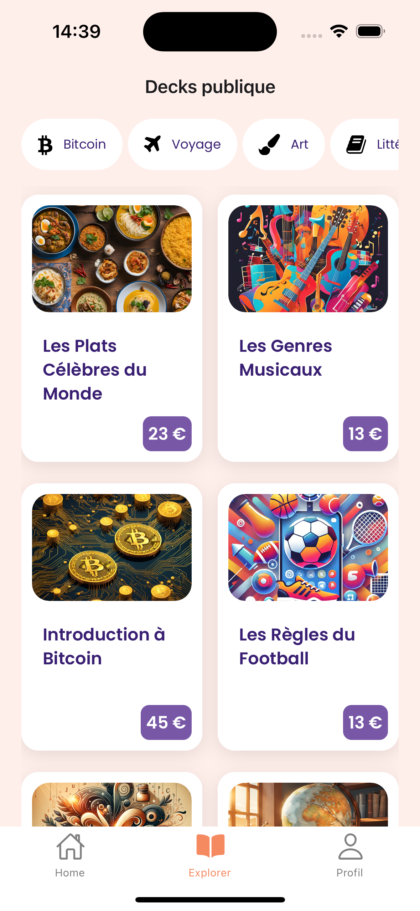

# Memorize-it

Une application mobile révolutionnaire pour **faciliter l'apprentissage** grâce à la méthode des flashcards.

## 📚 À propos de Memorize-it
**Memorize-it** est une application conçue pour rendre l'apprentissage **simple**, **accessible**, et **personnalisable**. Que vous soyez étudiant, professionnel en formation continue ou simplement curieux, Memorize-it vous aide à mémoriser efficacement grâce à des **decks de cartes** interactifs.

### 🎯 Objectif
Permettre à tous d'améliorer leur mémoire et leurs connaissances en utilisant une méthode d'apprentissage éprouvée, combinée à un outil numérique moderne.

---

## ✨ Fonctionnalités principales
- **Création et gestion de comptes utilisateurs** avec authentification sécurisée par token.
- **Création de decks personnalisés** pour répondre à vos besoins d'apprentissage spécifiques.
- **Bibliothèque publique de decks** prêts à l'emploi, disponibles à l'achat.
- **Mode interactif** pour jouer avec vos decks, en répondant aux questions des cartes.
- **Sécurité renforcée** pour protéger les données de vos comptes.

---

## 🚀 Installation

### Pré-requis
1. **Node.js version 18** et **npm** doivent être installés sur votre machine.
2. **Expo CLI** pour exécuter le projet.

### Étapes
1. Clonez le dépôt Git :  
   ```bash
   git clone <URL_DU_DEPOT>
   cd memorize-it
   ```
2. Installez les dépendances :  
   ```bash
   npm install
   ```
3. Ajoutez un fichier `.env` à la racine du projet avec le contenu suivant :  
   ```env
   EXPO_PUBLIC_API_URL=https://memorize-it-api.online 
4. Lancez l'application :  
   ```bash
   npm start
   ```

---

## 🛠️ Utilisation
1. **Créer un compte utilisateur** dans l'application.
2. Accédez à l'interface pour :
   - Créer des decks personnalisés.
   - Explorer et acheter des decks dans la **boutique** *(utilisez le code de carte bleue **4242 4242 4242 4242** pour effectuer des achats)*.
3. Lancez une session et commencez à répondre aux questions !

---

## 📦 Technologies utilisées
Voici un aperçu des principales technologies utilisées pour développer **Memorize-it** :

- **React Native** : pour le développement multiplateforme.
- **Expo** : pour la gestion et l'exécution du projet.
- **Redux Toolkit** : pour la gestion d'état.
- **Styled Components** : pour le stylisme dynamique.
- **OAT** : pour l'authentification sécurisée.
- **Stripe** : pour les paiements dans la boutique.

### 📄 Dépendances principales
Extrait du `package.json` :
```json
{
  "dependencies": {
    "@reduxjs/toolkit": "^2.3.0",
    "react-native": "0.76.3",
    "expo": "^52.0.11",
    "react-redux": "^9.1.2",
    "@stripe/stripe-react-native": "^0.40.0",
    "styled-components": "^6.1.13"
  }
}
```

---

## 🌟 Démonstration
### Interface utilisateur

Voici quelques aperçus de l'application :

<div style="display: flex; justify-content: space-around; align-items: center;">
   <div>
      *Écran de connexion sécurisée.*
      
   </div>
   <div>
      *Achetez des decks prêts à l'emploi directement dans l'application.*
      
   </div>
</div>


---

## 🤝 Contribution

Vous souhaitez contribuer à **Memorize-it** ? Super ! Voici comment démarrer :
1. Forkez le projet.
2. Créez une branche pour votre fonctionnalité ou correction (`git checkout -b feature/awesome-feature`).
3. Envoyez une pull request pour révision.

---

## 📜 Licence
Ce projet est sous licence **MIT**. Consultez le fichier [LICENSE](LICENSE) pour plus de détails.
